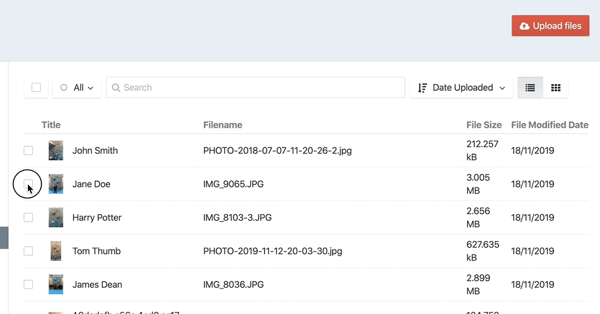

# Admin Asset URL plugin for Craft CMS 3.x

Displays the direct asset url link in the admin panel, useful for external linking.

## Requirements

This plugin requires Craft CMS 3.0.0-beta.23 or later.

## Installation

To install the plugin, follow these instructions.

1. Open your terminal and go to your Craft project:

        cd /path/to/project

2. Then tell Composer to load the plugin:

        composer require /admin-asset-url

3. In the Control Panel, go to Settings → Plugins and click the “Install” button for Admin Asset URL.

Brought to you by [Rework Digital](www.rework.digital)
